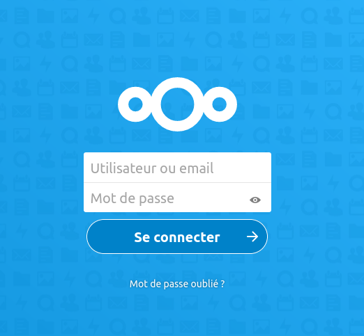

## Netxcloud sample configuration
### Nextcloud examples with traefik

Project structure:
```
.
├── secrets
│   ├── mysql-database.txt
│   ├── mysql-user.txt
│   ├── mysql-password.txt
├── docker-compose.yaml
├── gen-secrets.sh
└── README.md
```

[_docker-compose.yaml_](docker-compose.yaml)
```
version: '3.7'
services:
  database:
    image: mariadb:10
    restart: unless-stopped
    environment:
      .
      .
      .

  app:
    image: nextcloud:18
    restart: unless-stopped
    environment:
      .
      .
      .
    networks:
      - lan
      - traefik_web
    volumes:
      - html:/var/www/html
    labels:
      traefik.enable: true
      traefik.docker.network: traefik_web
      traefik.http.routers.nextcloud.entrypoints: websecure
      traefik.http.routers.nextcloud.rule: 'Host(`${NEXTCLOUD_URL}`)'
      traefik.http.services.nextcloud.loadbalancer.server.port: 80
    .
    .
    .

networks:
  traefik_web:
    external: true

  lan:

```

The compose file defines an application *Nextcloud* with two services `database` and `app`.
When deploying the application, docker-compose use secrets to store sensitive data like password or database information. This stack use *Traefik* network and service as reverse-proxy.

You can generate your secrets with `./gen-secrets.sh` 

## Prerequisites

Launch *Traefik* first. Please refer at `README.md` [here](https://github.com/lfache/awesome-traefik/blob/master/README.md) for more information.

Modify secrets with your own password or use `./gen-secrets.sh`.

## Deploy with docker-compose
This repository uses environment variables to pass `NEXTCLOUD_URL`, `NEXTCLOUD_ADMIN_USER`, `NEXTCLOUD_ADMIN_PASSWORD` to your stack.

```
$ NEXTCLOUD_URL=nextcloud.mydomain.com NEXTCLOUD_ADMIN_USER=admin NEXTCLOUD_ADMIN_PASSWORD=mypassword docker-compose up 

Creating network "nextcloud_lan" with the default driver
Pulling database (mariadb:10)...
10: Pulling from library/mariadb
23884877105a: Pull complete
bc38caa0f5b9: Pull complete
.
.
.
Digest: sha256:0fac2fa5ec295d16c356e567cfe676f92605b60f3b257f2958e23676c2acf937
Status: Downloaded newer image for mariadb:10
Pulling nextcloud (nextcloud:18)...
18: Pulling from library/nextcloud
afb6ec6fdc1c: Pull complete
3d895574014b: Pull complete
c309fdad6410: Pull complete
.
.
.
Digest: sha256:ea668a4178b2fca5549b54af87ce379ebfa69be6aaecb209add10920619cad1b
Status: Downloaded newer image for nextcloud:18
Creating nextcloud_database_1 ... done
Creating nextcloud_nextcloud_1 ... done

```

## Expected result

Listing containers must show two containers running:
```
$ docker ps
CONTAINER ID        IMAGE               COMMAND                  CREATED             STATUS              PORTS                                        NAMES
926a77ccc1e3        nextcloud:18        "/entrypoint.sh apac…"   46 seconds ago      Up 44 seconds       80/tcp                                       nextcloud_nextcloud_1
79d80fddd62b        mariadb:10          "docker-entrypoint.s…"   48 seconds ago      Up 45 seconds       3306/tcp                                     nextcloud_database_1
b2c95cb59ba3        traefik:2.2         "/entrypoint.sh trae…"   14 minutes ago      Up 14 minutes       0.0.0.0:80->80/tcp, 0.0.0.0:443->443/tcp   traefik_reverse_proxy_1
```

After the application starts, navigate to `https://nextcloud.mydomain.com` in your web browser to access Nextcloud installation:



Stop and remove the containers
```
$ docker-compose down
```

Stop and remove containers and volumes
```
$ docker-compose down -v
```
